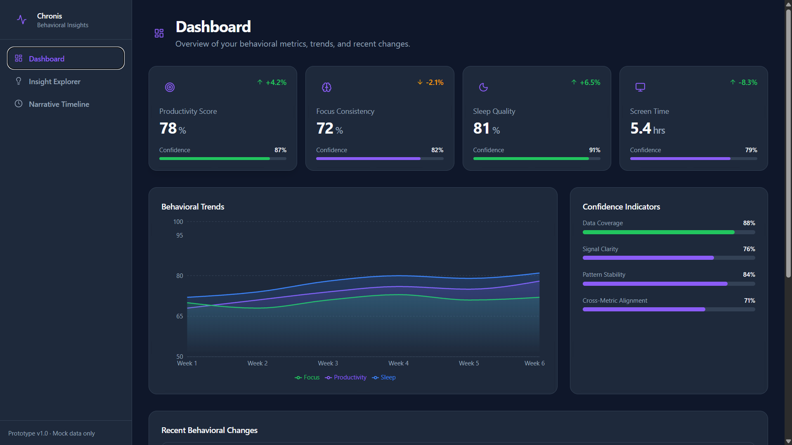
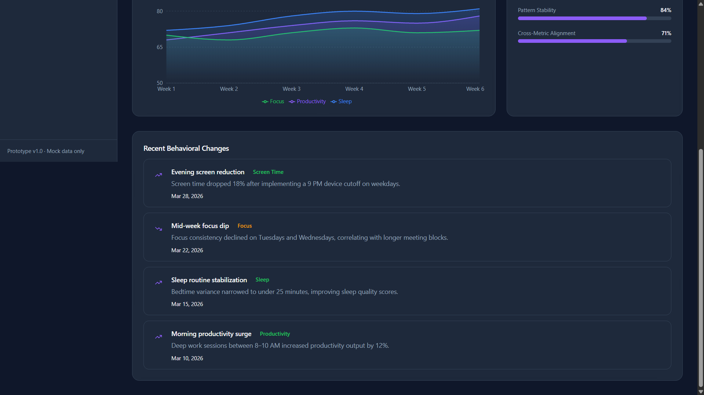
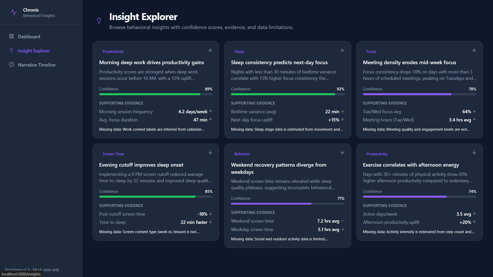
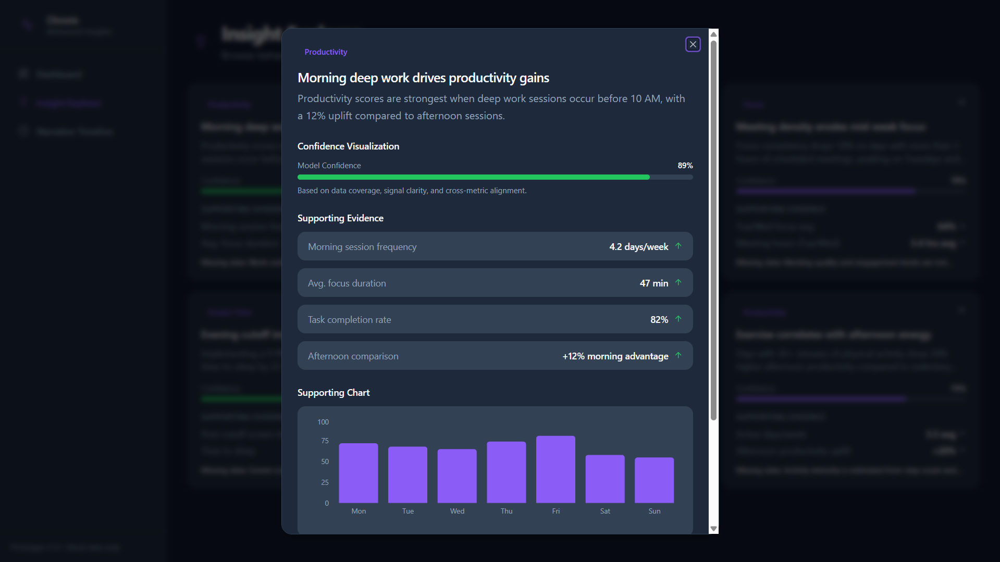
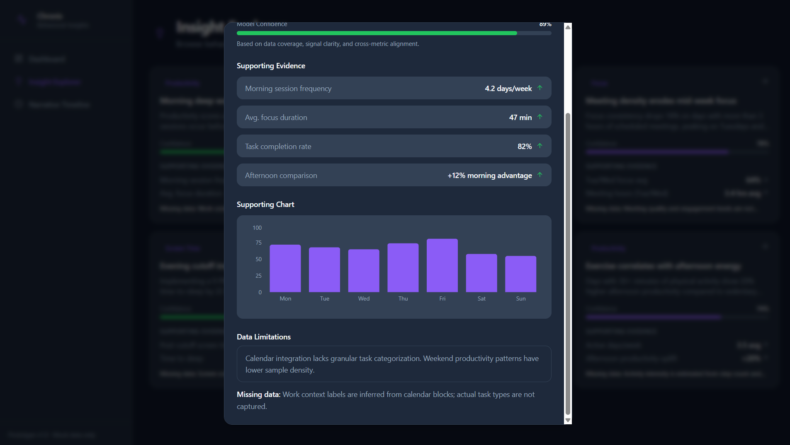
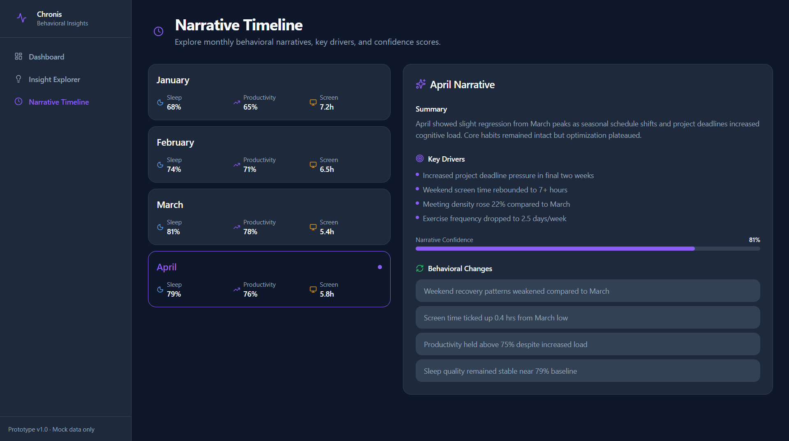

# Chronis Behavioral Insights Prototype

A modern, responsive behavioral analytics dashboard that allows users to explore trends, confidence indicators, insights, and historical behavioral narratives. Built as a frontend-only prototype with mock data—no backend, authentication, or database required.

## Project Overview

Chronis simulates a SaaS-style behavioral insights platform. Users can monitor KPIs (productivity, focus, sleep, screen time), drill into AI-generated insights with confidence scoring, and navigate a monthly narrative timeline of behavioral change.

## Features

### Dashboard
- KPI cards for Productivity Score, Focus Consistency, Sleep Quality, and Screen Time
- Multi-metric trend charts powered by Recharts
- Confidence indicator progress bars
- Recent behavioral change feed with impact categorization

### Insight Explorer
- Insight cards with observation summaries, confidence scores, and supporting evidence
- Click-to-open detail modal with evidence list, confidence visualization, supporting chart, and data limitations

### Narrative Timeline
- Interactive monthly timeline (January–April)
- Per-month sleep, productivity, and screen time metrics
- Selected month panel with summary, key drivers, confidence score, and behavioral changes

## Screenshots

# Screenshots

## Dashboard




## Insight Explorer





## Timeline




## Tech Stack

| Technology | Purpose |
|------------|---------|
| Next.js 14 (App Router) | Framework and routing |
| TypeScript | Type-safe development |
| TailwindCSS | Utility-first styling |
| shadcn/ui | Accessible UI primitives (Dialog, Card, Button, Badge) |
| Recharts | Trend and insight charts |
| Framer Motion | Page and component animations |
| Lucide React | Icon system |

## Folder Structure

```
chronis-behavioral-insights/
├── src/
│   ├── app/
│   │   ├── globals.css          # Theme variables and base styles
│   │   ├── layout.tsx           # Root layout with AppShell
│   │   ├── page.tsx             # Dashboard
│   │   ├── insights/page.tsx    # Insight Explorer
│   │   └── timeline/page.tsx    # Narrative Timeline
│   ├── components/
│   │   ├── ui/                  # shadcn/ui primitives
│   │   ├── AppShell.tsx         # Layout wrapper
│   │   ├── Sidebar.tsx          # Desktop navigation
│   │   ├── MobileNav.tsx        # Mobile drawer navigation
│   │   ├── PageHeader.tsx       # Page title block
│   │   ├── StatCard.tsx         # KPI card
│   │   ├── ConfidenceBar.tsx    # Confidence progress bar
│   │   ├── TrendChart.tsx       # Dashboard trend chart
│   │   ├── InsightCard.tsx      # Insight list card
│   │   ├── InsightModal.tsx     # Insight detail modal
│   │   ├── TimelineItem.tsx     # Timeline month selector
│   │   ├── TimelinePanel.tsx    # Timeline detail panel
│   │   └── RecentChanges.tsx    # Behavioral changes list
│   ├── config/
│   │   └── navigation.ts        # Nav routes and icons
│   ├── data/
│   │   ├── insights.ts          # Mock insight data
│   │   ├── trends.ts            # Mock KPI and trend data
│   │   └── timeline.ts          # Mock timeline data
│   ├── lib/
│   │   └── utils.ts             # cn() and formatters
│   └── types/
│       └── index.ts             # Shared TypeScript types
├── public/
├── package.json
├── tailwind.config.ts
├── tsconfig.json
└── README.md
```

## Setup Instructions

### Prerequisites

- Node.js 18+
- npm

### Installation

```bash
git clone <your-repo-url>
cd chronis-behavioral-insights
npm install
```

### Development

```bash
npm run dev
```

Open [http://localhost:3000](http://localhost:3000) in your browser.

### Production Build

```bash
npm run build
npm start
```

### Lint

```bash
npm run lint
```

## UX Decisions

- **Dark SaaS theme** — Slate background (`#0F172A`) with violet primary (`#8B5CF6`) reduces eye strain and matches modern analytics products.
- **Confidence-first design** — Every KPI and insight surfaces a confidence score so users understand data reliability, not just the metric value.
- **Progressive disclosure** — Insight cards show summaries; the modal reveals full evidence, charts, and limitations on demand.
- **Mobile drawer navigation** — Sidebar collapses to an animated drawer on small screens for full responsiveness.
- **Motion with purpose** — Framer Motion handles staggered card entrances and timeline transitions without distracting from data.

## Tradeoffs

| Decision | Rationale |
|----------|-----------|
| Mock data only | Keeps the prototype deployable without infrastructure; suitable for internship demos |
| Client components for interactivity | Modal, timeline selection, and mobile nav require client state; server components used where possible (Dashboard KPI section) |
| No shadcn CLI | Manual shadcn/ui setup avoids interactive init; only required primitives are included |
| Single trend chart on dashboard | Screen time uses a different scale (hours vs. percentages); shown in KPI card rather than mixed-axis chart |
| Static monthly timeline | Four months of narrative data is sufficient for prototype storytelling |

## Future Improvements

- [ ] Real data pipeline with wearable and calendar integrations
- [ ] User authentication and personalized dashboards
- [ ] Exportable PDF/CSV reports
- [ ] Insight filtering by category and confidence threshold
- [ ] Comparative timeline view (month-over-month deltas)
- [ ] Light mode theme toggle
- [ ] Accessibility audit and keyboard navigation polish
- [ ] End-to-end tests with Playwright

## License

This project is submitted as an internship assignment prototype. All rights reserved.
"# Behavioral_Insinghts" 
